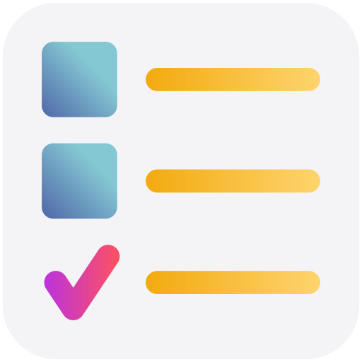

<div align="center">



# 🛒 Quick List

**A fast, offline grocery & to-do list app for Android.**
Jot it down, check it off, drag to reorder — all stored right on your phone,
no account, no internet.

<br />


</div>

---

## ✨ Features

- 🗂️ &nbsp;**Multiple lists** — switch, create, rename, and delete from a chip bar
- ➕ &nbsp;**Quick add** — a bottom-anchored input that stays out of the keyboard's way
- ✏️ &nbsp;**Inline edit** — tap any item to rename it
- ✅ &nbsp;**Check off** — done items drop into a collapsible "done" section
- ↕️ &nbsp;**Drag to reorder** — rearrange your "to do" items by the handle
- 🗑️ &nbsp;**Swipe to delete** — with a 5-second **undo**
- 📴 &nbsp;**Fully offline** — everything lives in the device's local storage
- 🚀 &nbsp;**Stays smooth** — the list is virtualized, so even long lists scroll fast

---

## 🧰 Tech Stack

- 🅰️ &nbsp;**Angular 22** — standalone components, signals, OnPush change detection
- ⚡ &nbsp;**Ionic 8** — UI components
- 📱 &nbsp;**Capacitor 8** — native Android / iOS shell
- 🧩 &nbsp;**Angular CDK** — virtual scroll + drag-and-drop
- 🎨 &nbsp;**Tailwind CSS 4**
- 💾 &nbsp;**@ionic/storage** — IndexedDB persistence

---

## 🚦 Prerequisites

- 🟢 &nbsp;**Node.js ≥ 22.22.3** (or ≥ 24.15) — required by the Angular 22 CLI
- 🤖 &nbsp;**Android Studio** (for device builds) — provides the SDK and a bundled
  JDK 21, so no separate JDK install is needed

---

## 🏁 Getting Started

### 📦 Install

```bash
npm install
```

### 🌐 Run in the browser (development)

```bash
npm start
```

Then open **http://localhost:4200**. Great for logic and UI work — though the
keyboard, scrolling, and reorder behaviours are best checked on a real device.

### 🏗️ Build the web app

```bash
npm run build      # → outputs to www/
```

---

## 📲 Run on an Android Device

**1.** 🔌 &nbsp;Connect your phone via USB with USB debugging enabled & authorized.

**2.** 🔄 &nbsp;Build the web app and sync it into the native project:

```bash
npm run build
npx cap sync android
```

**3.** 📥 &nbsp;Build and install the debug APK (uses Android Studio's bundled JDK):

```bash
cd android
# Git Bash on Windows:
export JAVA_HOME="/c/Program Files/Android/Android Studio/jbr"
export ANDROID_HOME="$LOCALAPPDATA/Android/Sdk"
./gradlew installDebug
```

> 💡 &nbsp;Prefer a GUI? Run `npx cap open android` and hit **Run** in Android Studio.

---

## 🗂️ Project Structure

```text
src/app/
├── app.component.*      🧭 App shell: startup, keyboard handling, background flush
├── services/           💾 Signal store + IndexedDB storage wrapper
├── component/          🧱 list-container · input-container · list-selector
└── models/             📐 ListItem / GroceryList types
android/ · ios/         📱 Capacitor native projects
```

---

## 📝 Notes

- 🧪 &nbsp;There's no automated test suite — changes are verified by running the app.
- 📖 &nbsp;See **[CLAUDE.md](CLAUDE.md)** for architecture details and contributor
  gotchas (TypeScript version pinning, the upgrade procedure, and more).

<div align="center">

<sub>Made for daily use · 100% local · 0 tracking</sub>

</div>
